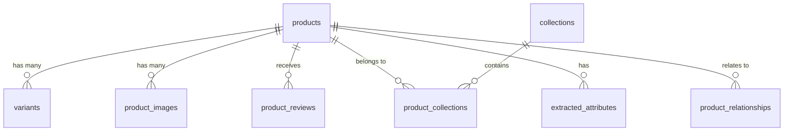

# 🗄️ AstroTalk Scraper Database Documentation

This document provides a comprehensive overview of the **astrotalk_scraper** database schema, relationships, and data sources. This database is designed for high-integrity commerce analysis and spiritual attribute extraction.

---

## 🏗️ Database Overview
- **System**: PostgreSQL 18
- **Database Name**: `astrotalk_scraper`
- **Tables**: 9 normalized tables
- **Storage Strategy**: Relational storage for structured querying + JSONB for raw data preservation.

---

## 🔗 Entity Relationship Diagram (ERD)



---

## 📋 Table Details

### 1. `products`
**Source**: `https://astrotalk.store/products.json`  
Main catalog table containing primary product information.

| Column | Type | Description |
| :--- | :--- | :--- |
| `id` | BIGINT (PK) | Shopify unique product ID |
| `title` | TEXT | Product name |
| `handle` | TEXT (Unique) | URL slug |
| `product_type` | TEXT | Category (e.g., Bracelet, Pendant) |
| `vendor` | TEXT | Supplier name |
| `tags` | TEXT[] | Array of product tags |
| `body_html` | TEXT | Full description with HTML |
| `scraped_at` | TIMESTAMPTZ | Timestamp of last extraction |

**Sample Entry:**
```json
{
  "id": 84123456789,
  "title": "Natural Citrine Healing Bracelet",
  "handle": "citrine-healing-bracelet",
  "product_type": "Bracelet",
  "vendor": "AstroTalk"
}
```

---

### 2. `variants`
**Source**: `https://astrotalk.store/products.json`  
Specific options for products (e.g., Size, Color, Metal Type).

| Column | Type | Description |
| :--- | :--- | :--- |
| `id` | BIGINT (PK) | Shopify unique variant ID |
| `product_id` | BIGINT (FK) | Reference to `products.id` |
| `title` | TEXT | Variant name (e.g., "Silver / 8mm") |
| `price` | DECIMAL | Current selling price |
| `sku` | TEXT | Stock keeping unit |
| `available` | BOOLEAN | Inventory status |

**Sample Entry:**
```json
{
  "id": 45123456789,
  "product_id": 84123456789,
  "title": "Silver Plated",
  "price": 899.00,
  "available": true
}
```

---

### 3. `collections`
**Source**: `https://astrotalk.store/collections.json`  
Store categories and collections.

| Column | Type | Description |
| :--- | :--- | :--- |
| `id` | BIGINT (PK) | Shopify unique collection ID |
| `title` | TEXT | Collection name |
| `handle` | TEXT (Unique) | URL slug |
| `products_count`| INT | Total products in collection |

**Sample Entry:**
```json
{
  "id": 26123456789,
  "title": "Best Sellers",
  "handle": "best-sellers",
  "products_count": 45
}
```

---

### 4. `product_collections`
**Source**: `https://astrotalk.store/collections/{handle}/products.json`  
Junction table mapping products to their respective collections.

| Column | Type | Description |
| :--- | :--- | :--- |
| `product_id` | BIGINT (FK) | Reference to `products.id` |
| `collection_id`| BIGINT (FK) | Reference to `collections.id` |
| `position` | INT | Display order within collection |

---

### 5. `extracted_attributes`
**Source**: *Internal Extraction Logic* (Regex matching on `products.body_html`)  
Spiritual and astrology-specific metadata.

| Column | Type | Description |
| :--- | :--- | :--- |
| `product_id` | BIGINT (FK) | Reference to `products.id` |
| `attribute_type`| TEXT | Category (Zodiac, Crystal, Chakra) |
| `attribute_key` | TEXT | Field name (e.g., "Zodiac Sign") |
| `attribute_value`| TEXT | Value (e.g., "Aries") |

**Sample Entry:**
```json
{
  "product_id": 84123456789,
  "attribute_type": "Zodiac",
  "attribute_key": "Sign",
  "attribute_value": "Leo"
}
```

---

### 6. `product_reviews`
**Source**: `https://api.judge.me`  
Customer reviews and ratings for products.

| Column | Type | Description |
| :--- | :--- | :--- |
| `external_id` | TEXT (Unique) | Judge.me unique review ID |
| `product_id` | BIGINT (FK) | Reference to `products.id` |
| `rating` | INT | Star rating (1-5) |
| `body` | TEXT | Review comment content |
| `verified` | BOOLEAN | If reviewer is a verified buyer |

---

### 7. `product_images`
**Source**: `https://astrotalk.store/products.json`  
Image gallery for products.

| Column | Type | Description |
| :--- | :--- | :--- |
| `id` | BIGINT (PK) | Shopify image ID |
| `product_id` | BIGINT (FK) | Reference to `products.id` |
| `src` | TEXT | Image URL |
| `alt` | TEXT | Alternative text for image |

---

### 8. `raw_api_logs`
**Source**: *Internal Pipeline Tracker*  
Full audit trail of all network requests made by the scraper.

| Column | Type | Description |
| :--- | :--- | :--- |
| `endpoint` | TEXT | API URL called |
| `status_code` | INT | HTTP response code (200, 403, etc.) |
| `raw_file_path` | TEXT | Path to the saved JSON response |

---

## 📈 Database Purpose
1. **Analytics**: Track inventory, pricing trends, and collection growth.
2. **AI Enrichment**: Provide structured data for LLM training or RAG systems (Astrology-specific).
3. **Traceability**: Every data point in the DB can be traced back to a raw JSON file via `raw_api_logs`.

---
<p align="center">
  <strong>Version 1.0.0</strong> | AstroTalk Data Architecture
</p>
